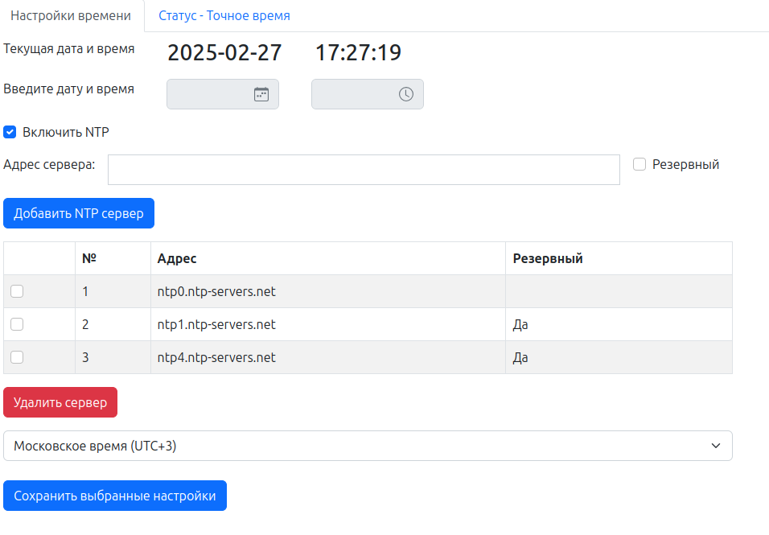
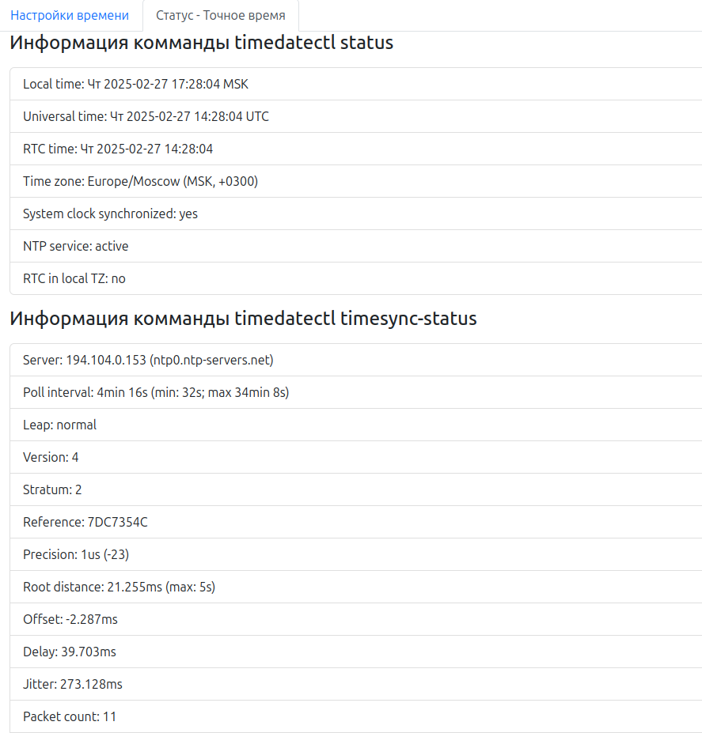

NTP Configuration
---

Программа для управления системным временем и настройки NTP

**Особенности**:  
- При первом запуске создается локальный конфигурационный файл localsync.conf.
### Вид файла localsync.conf
```
ntp_on=1
Date=2025-02-26
Time=11:50:40
NTP=ntp.ubuntu.com
FallbackNTP=test.ntp.com
Timezone=Europe/Moscow
```

- При последующих открытиях/перезагрузках данные для отображения подтягиваются из него  
Добавить скриншот с файлом

---

Окно "Настройка времени"
---



В этом окне пользователь может настроить время вручную, либо включить NTP
 - Для всех вводимых полей подключены валидаторы
 - Выбор и удаление NTP серверов я решил сделать через таблицу, т.к. по мне - это удобно и наглядно
 - После принятия измерений данные сохраняются в файлы localsync.conf и /etc/systemd/timesyncd.conf

При успешном принятии измененией выводится оповещение и, если был установлен флаг "Включить NTP" изменяется файл /etc/systemd/timesyncd.conf

---

Окно "Статус - Точное время"
---

В этом окне выводится выполнение комманд "timedatectl status" и "timedatectl timesync-status"



---
